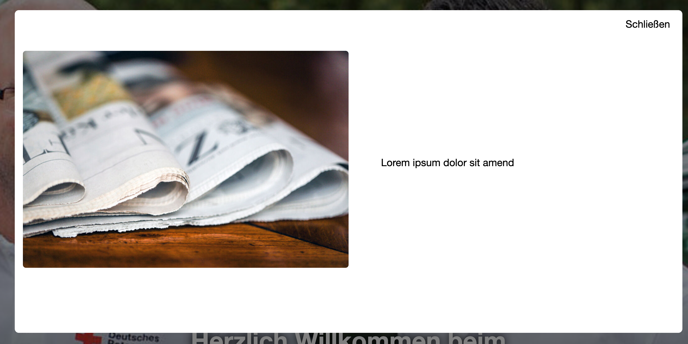
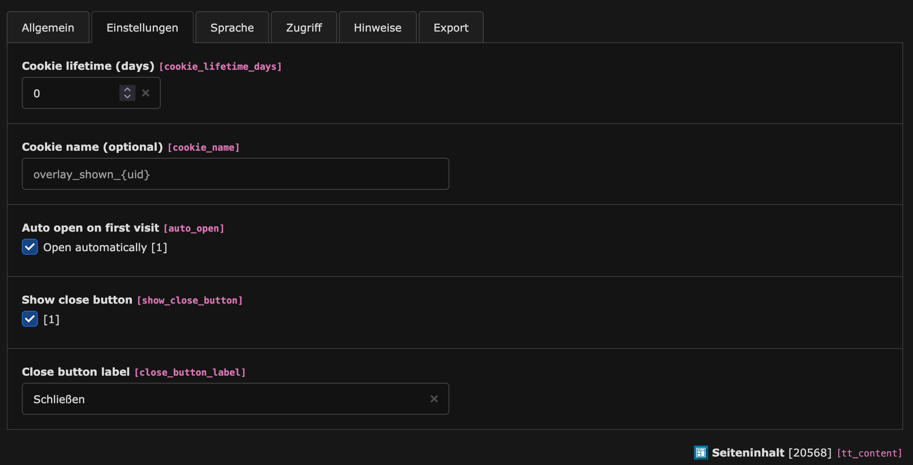

# TYPO3 Extension: dialog_overlay

Container content element with an HTML5 `<dialog>` (modal) that can be shown automatically once per visitor using a cookie. Ships a small Web Component that handles auto‑open and cookie logic. Built for the b13/container.

- Extension key: `dialog_overlay`
- Package name: `fucodo/dialog-overlay`
- TYPO3: ^12.4 or ^13.0
- Requires: `b13/container` ^2 or ^3
- License: GPL-2.0-or-later

## Examples

### Frontend



### Backend



## Features
- New content element: “Dialog Overlay (einmalig)” (`CType = dialog_overlay`)
- HTML5 `<dialog>` modal including optional close button
- Auto‑open once per user using a cookie (configurable name and lifetime)
- Integrates with b13/container: provides one area for dialog content
- Minimal default styling; easy to override
- Static TypoScript for Fluid template registration and rendering

## Installation
1. Install the extension (part of this distribution) and ensure dependencies are available:
   - TYPO3 Core ^12.4 or ^13
   - `b13/container` ^2 or ^3
2. Include the static TypoScript template in your site template:
   - Template record → Includes → Add “Dialog Overlay (CE & FE Rendering)”.
3. PageTS is auto‑imported by the extension (see `ext_localconf.php`), so the New Content Element Wizard entry is available under the "special" group.

## Usage (Editor)
1. In the New Content Element Wizard, choose: Special → “Dialog Overlay (einmalig)”.
2. Fill the fields:
   - Titel (header): Optional title; not rendered by default but useful for backend identification.
   - Einstellungen (Settings):
     - Cookie‑Lebensdauer (Tage): Number of days the “already shown” cookie should live (default 30; 1–3650).
     - Cookie‑Name: Optional. If empty, defaults to `overlay_shown_{uid}`.
     - Automatisch öffnen: If checked, the dialog opens automatically on page load (default on). If unchecked, the dialog won’t auto‑open and can be opened via custom JS.
     - Schließen‑Button anzeigen: If checked, renders a close button inside the dialog (default on).
     - Beschriftung Schließen‑Button: Optional label (default “Schließen”).
3. Dialog‑Inhalt: Add and arrange any content elements in the provided container area. They render inside the modal.

## Rendering & Frontend
- Fluid template: `Resources/Private/Templates/Content/DialogOverlay.html`
- TypoScript setup registers the template via `tt_content.dialog_overlay` and `templateRootPaths`.
- The markup renders a Web Component `<fucodo-modal-once>` with attributes:
  - `data-cookie-name`: Cookie name. Defaults to `overlay_shown_{uid}` if not set.
  - `data-cookie-days`: Cookie lifetime (days). Defaults to `30`.
  - `data-auto-open`: `"1"` or `"0"` to enable/disable auto‑open.
- Inside the component there is a native `<dialog class="dialog-overlay">` element containing your content and an optional close button.

### JavaScript behavior
The script `Resources/Public/JavaScript/dialog-overlay.js` defines the custom element `fucodo-modal-once`:
- On connect, it determines cookie name, days, and auto‑open mode from attributes.
- If auto‑open is enabled and the cookie isn’t set, it opens the dialog (prefers `showModal()`, falls back to `open` attribute).
- When the `<dialog>` is closed (e.g., via the close button), it writes a cookie with `SameSite=Lax` and `Secure` on HTTPS.
- Uses a cookie name derived from the content element UID if no explicit name is provided.

### Styling
A small default stylesheet is included via `<f:asset.css>`:
- Path: `EXT:dialog_overlay/Resources/Public/Webcomponents/fucodo-dialog-overlay/dist/index.css`
- Selectors it defines by default:
  - `.dialog-overlay::backdrop { background: rgba(0,0,0,.5); }`
  - `.dialog-overlay { border: 0; border-radius: .5rem; padding: 0; }`
  - `.dialog-content { padding: 1rem; }`
  - `.dialog-close-btn { display: inline-block; margin: 1rem; margin-top: .75rem; margin-right: 1.5rem; float: right; }`

How to customize:
- Override with site CSS loaded after the extension’s CSS (preferred). Example:

```css
/* increase backdrop opacity and content spacing */
.dialog-overlay::backdrop { background: rgba(0,0,0,.65); }
.dialog-content { padding: 1.5rem; }

/* constrain dialog width responsively */
.dialog-overlay { width: min(90vw, 48rem); }

/* place the close button differently */
.dialog-close-btn { float: none; margin: 0; }
```

- Replace the stylesheet entirely by overriding the Fluid template `DialogOverlay.html` in your sitepackage and removing or swapping the `<f:asset.css ...>` line.

### Accessibility notes
- Uses the native `<dialog>` element with `aria-modal="true"`.
- Ensure a visible, accessible close control is present (the provided close button uses `method="dialog"`).
- Keep focusable elements inside the dialog and provide meaningful content. Test keyboard navigation and screen reader announcements in your target browsers.

### Privacy & Cookies
- A single cookie is set on dialog close to remember that the dialog was shown.
- Attributes:
  - Name: configurable (`cookie_name` or `overlay_shown_{uid}` fallback)
  - Lifetime: configurable (days)
  - Path: `/`, `SameSite=Lax`, `Secure` when on HTTPS
- Adjust your privacy policy as needed.

## Integrator reference

### TCA fields (tt_content)
- `cookie_lifetime_days`: number (default 30, range 1–3650)
- `cookie_name`: input (placeholder `overlay_shown_{uid}`)
- `auto_open`: check (default 1)
- `show_close_button`: check (default 1)
- `close_button_label`: input (default “Schließen”; shown only if `show_close_button` is enabled)

### Container setup
- Uses `b13/container` with a single area labeled “Dialog-Inhalt” at `colPos = 201`.
- In Fluid, children are available via `{children_201}` and are rendered as provided.

### Overriding templates and assets
- Templates: Add your own `templateRootPaths.20` in your site package to override `DialogOverlay.html`.
- JavaScript: If you need custom logic, you can deliver your own script and either:
  - Override the Fluid template to load it instead of `dialog-overlay.js`, or
  - Keep the provided component and extend it in your own script.

### TypoScript
The extension delivers a static TypoScript include titled “Dialog Overlay (CE & FE Rendering)” which registers:
- `tt_content.dialog_overlay` based on `lib.contentElement`
- `templateRootPaths.10 = EXT:dialog_overlay/Resources/Private/Templates/Content`

## Opening the dialog manually
If `data-auto-open="0"`, you can open the dialog from custom code:

```js
const el = document.querySelector('fucodo-modal-once');
const dlg = el?.querySelector('dialog');
if (dlg) {
  if (typeof dlg.showModal === 'function') dlg.showModal();
  else dlg.setAttribute('open', '');
}
```

Note: The “shown once” cookie is set when the dialog fires its `close` event. If you close the dialog programmatically, the cookie will also be set by the component.

## Known limitations
- Native `<dialog>` support varies. The component falls back to the `open` attribute if `showModal()` fails, but full focus trapping may differ between browsers. Consider a ponyfill if you need broader guarantees.

## Icons
- The icon identifier for the content type is `content-dialog-overlay`.

## Changelog
See the project’s VCS history. If you maintain a `Changelog.md` in your distribution, keep extension‑specific entries there.

## Support
This extension is part of your site distribution. For issues, please use your project’s regular support channels or your integrator’s contact.
